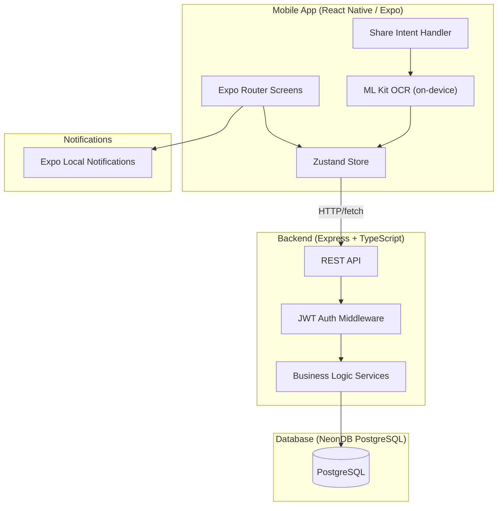
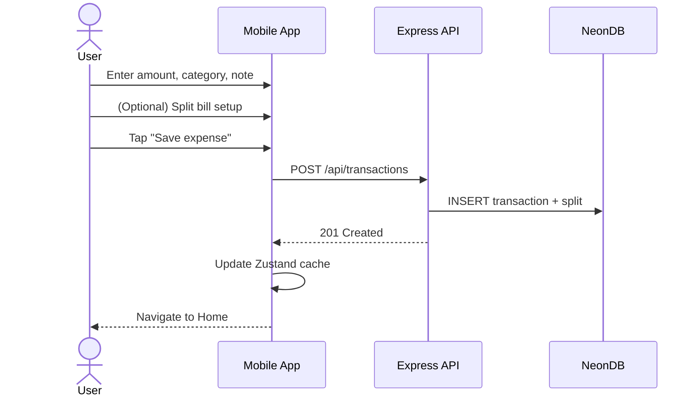
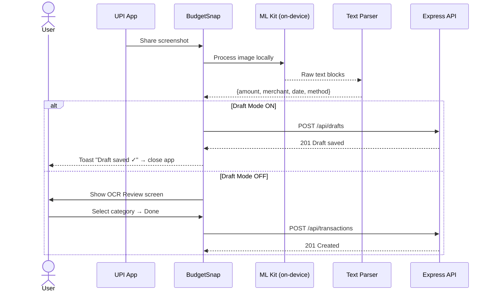
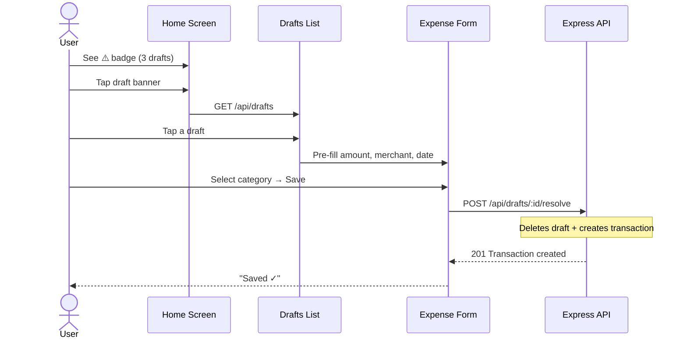

# BudgetSnap — React Native Budget App

A budget-first expense tracker that minimizes friction for logging expenses through manual entry, screenshot OCR, and share-intent integration.

---

## Decisions Locked In

| Decision | Choice |
|----------|--------|
| Backend | Custom **Express + TypeScript** with **PostgreSQL (NeonDB)** |
| Auth | Simple **JWT-based** email/password (no Firebase) |
| OCR | **Google ML Kit** (on-device, free) |
| Currency | **INR only** (₹) |
| Target Platform | **Android-first** (iOS-compatible structure for future) |
| Categories | Max **10** per budget (from a predefined set of ~15-20) |
| Split Bill | Tracks **your share** per transaction only — no debt/settlement tracking |
| Safe to Spend | **Per-category**: `category_remaining / days_left_in_month` |
| Spend Intent | ❌ Not included |
| Smart Spending Score | ❌ Not included |
| Bank Statement | ❌ Deferred to Phase 2 |
| Credits/Income | ❌ Deferred to Phase 2 |
| Data Export | ✅ PDF + CSV |

---

## Architecture Overview



### Why This Architecture

- **Backend handles all data**: Every transaction, budget, and category lives in Postgres. The mobile app is a thin client that fetches/pushes data via REST.
- **OCR stays on-device**: No image uploads needed — ML Kit processes screenshots locally, then sends extracted structured data to the backend.
- **Zustand as a cache layer**: Stores the current session's data locally for fast UI rendering, syncs with backend on mutations.

---

## Tech Stack

| Layer | Technology | Rationale |
|-------|-----------|-----------|
| **Mobile** | | |
| Framework | Expo SDK 53 (managed) | Fast dev cycle, EAS builds for Android |
| Navigation | Expo Router (file-based) | Tab + stack routing with deep links |
| State | Zustand + React Query | Zustand for UI state, React Query for server state/caching |
| OCR | react-native-mlkit-ocr | On-device, free, offline-capable |
| Notifications | expo-notifications | Local scheduled notifications |
| Share Intent | expo-share-intent | Receive shared images from UPI apps |
| Charts | react-native-gifted-charts | Performant, customizable |
| Animations | react-native-reanimated | Smooth micro-animations |
| HTTP | axios | API calls with interceptors for auth |
| **Backend** | | |
| Runtime | Node.js + Express | Lightweight, familiar |
| Language | TypeScript | Type safety end-to-end |
| Database | PostgreSQL (NeonDB) | Managed, serverless Postgres |
| ORM | Drizzle ORM | Type-safe, lightweight, great DX |
| Auth | bcrypt + jsonwebtoken | Simple JWT auth, no third-party dependency |
| Validation | Zod | Request validation, shared with frontend types |
| PDF/CSV Export | pdfkit + json2csv | Server-side export generation |

---

## Database Schema (PostgreSQL / NeonDB)

```sql
-- ============================================
-- USERS
-- ============================================
CREATE TABLE users (
  id UUID PRIMARY KEY DEFAULT gen_random_uuid(),
  name VARCHAR(100) NOT NULL,
  email VARCHAR(255) UNIQUE NOT NULL,
  password_hash VARCHAR(255) NOT NULL,
  created_at TIMESTAMPTZ DEFAULT NOW(),
  updated_at TIMESTAMPTZ DEFAULT NOW()
);

-- ============================================
-- MONTHLY BUDGETS
-- ============================================
CREATE TABLE budgets (
  id UUID PRIMARY KEY DEFAULT gen_random_uuid(),
  user_id UUID NOT NULL REFERENCES users(id) ON DELETE CASCADE,
  month SMALLINT NOT NULL CHECK (month BETWEEN 1 AND 12),
  year SMALLINT NOT NULL,
  total_amount DECIMAL(12,2) NOT NULL,
  created_at TIMESTAMPTZ DEFAULT NOW(),
  updated_at TIMESTAMPTZ DEFAULT NOW(),
  UNIQUE(user_id, month, year)
);

-- ============================================
-- CATEGORIES (per budget, max 10)
-- ============================================
CREATE TABLE categories (
  id UUID PRIMARY KEY DEFAULT gen_random_uuid(),
  budget_id UUID NOT NULL REFERENCES budgets(id) ON DELETE CASCADE,
  name VARCHAR(50) NOT NULL,
  icon VARCHAR(50) NOT NULL,        -- icon identifier
  color VARCHAR(7) NOT NULL,        -- hex color
  allocated_amount DECIMAL(12,2) NOT NULL,
  sort_order SMALLINT NOT NULL DEFAULT 0,
  created_at TIMESTAMPTZ DEFAULT NOW()
);

-- Enforce max 10 categories per budget via application layer + CHECK trigger

-- ============================================
-- TRANSACTIONS
-- ============================================
CREATE TABLE transactions (
  id UUID PRIMARY KEY DEFAULT gen_random_uuid(),
  user_id UUID NOT NULL REFERENCES users(id) ON DELETE CASCADE,
  category_id UUID NOT NULL REFERENCES categories(id),
  amount DECIMAL(12,2) NOT NULL,         -- total transaction amount
  your_share DECIMAL(12,2) NOT NULL,     -- what YOU actually spent (= amount if no split)
  note TEXT,
  merchant VARCHAR(200),
  payment_method VARCHAR(20) DEFAULT 'UPI',  -- 'UPI', 'Card', 'Cash', 'Net Banking'
  transaction_date TIMESTAMPTZ NOT NULL,
  source VARCHAR(20) DEFAULT 'manual',       -- 'manual', 'ocr'
  created_at TIMESTAMPTZ DEFAULT NOW()
);

CREATE INDEX idx_txn_user_date ON transactions(user_id, transaction_date DESC);
CREATE INDEX idx_txn_category ON transactions(category_id);

-- ============================================
-- SPLIT DETAILS (only when bill is split)
-- ============================================
CREATE TABLE splits (
  id UUID PRIMARY KEY DEFAULT gen_random_uuid(),
  transaction_id UUID UNIQUE NOT NULL REFERENCES transactions(id) ON DELETE CASCADE,
  split_method VARCHAR(20) NOT NULL,      -- 'evenly', 'amount', 'fraction', 'percentage'
  total_people SMALLINT NOT NULL CHECK (total_people >= 2)
);

CREATE TABLE split_participants (
  id UUID PRIMARY KEY DEFAULT gen_random_uuid(),
  split_id UUID NOT NULL REFERENCES splits(id) ON DELETE CASCADE,
  label VARCHAR(10) NOT NULL,             -- 'You', 'P1', 'P2', etc.
  share DECIMAL(12,2) NOT NULL,           -- their portion of the bill
  is_you BOOLEAN DEFAULT FALSE
);

-- ============================================
-- DRAFT TRANSACTIONS (pending categorization from OCR)
-- ============================================
CREATE TABLE drafts (
  id UUID PRIMARY KEY DEFAULT gen_random_uuid(),
  user_id UUID NOT NULL REFERENCES users(id) ON DELETE CASCADE,
  amount DECIMAL(12,2),
  merchant VARCHAR(200),
  transaction_date TIMESTAMPTZ,
  payment_method VARCHAR(20),
  raw_ocr_text TEXT,
  created_at TIMESTAMPTZ DEFAULT NOW(),
  expires_at TIMESTAMPTZ NOT NULL         -- created_at + 3 days
);

CREATE INDEX idx_draft_user_expiry ON drafts(user_id, expires_at);

-- ============================================
-- USER SETTINGS
-- ============================================
CREATE TABLE user_settings (
  user_id UUID PRIMARY KEY REFERENCES users(id) ON DELETE CASCADE,
  draft_mode BOOLEAN DEFAULT FALSE,
  notif_category_limit BOOLEAN DEFAULT TRUE,    -- warn at 80%
  notif_daily_summary BOOLEAN DEFAULT FALSE,
  notif_daily_summary_time TIME DEFAULT '21:00',
  notif_monthly_reset BOOLEAN DEFAULT TRUE,
  updated_at TIMESTAMPTZ DEFAULT NOW()
);
```

---

## Backend API Design

### Auth Endpoints

| Method | Endpoint | Description |
|--------|----------|-------------|
| POST | `/api/auth/register` | Create account (name, email, password) |
| POST | `/api/auth/login` | Login → returns JWT access token + refresh token |
| POST | `/api/auth/refresh` | Refresh expired access token |
| DELETE | `/api/auth/account` | Delete account + all data |

### Budget Endpoints

| Method | Endpoint | Description |
|--------|----------|-------------|
| POST | `/api/budgets` | Create budget for a month/year with categories |
| GET | `/api/budgets/current` | Get current month's budget + categories |
| GET | `/api/budgets` | List all budgets (for archive/stats screen) |
| PUT | `/api/budgets/:id` | Update budget amount |
| PUT | `/api/budgets/:id/categories` | Update category allocations |

### Transaction Endpoints

| Method | Endpoint | Description |
|--------|----------|-------------|
| POST | `/api/transactions` | Create transaction (with optional split) |
| GET | `/api/transactions?month=9&year=2026` | Get transactions for a month |
| GET | `/api/transactions/recent?limit=5` | Get recent transactions |
| GET | `/api/transactions/:id` | Get single transaction with split details |
| DELETE | `/api/transactions/:id` | Delete transaction |

### Draft Endpoints

| Method | Endpoint | Description |
|--------|----------|-------------|
| POST | `/api/drafts` | Create draft from OCR data |
| GET | `/api/drafts` | Get all active (non-expired) drafts |
| POST | `/api/drafts/:id/resolve` | Convert draft → transaction (user adds category) |
| DELETE | `/api/drafts/:id` | Discard a draft |

### Stats / Export Endpoints

| Method | Endpoint | Description |
|--------|----------|-------------|
| GET | `/api/stats/summary` | Monthly summary (total spent, per category, avg) |
| GET | `/api/stats/archive` | Archive data: all months, trend, best month |
| GET | `/api/export/csv?month=9&year=2026` | Download CSV export |
| GET | `/api/export/pdf?month=9&year=2026` | Download PDF export |

### Settings Endpoints

| Method | Endpoint | Description |
|--------|----------|-------------|
| GET | `/api/settings` | Get user settings |
| PUT | `/api/settings` | Update settings |
| PUT | `/api/profile` | Update name/email |

---

## Proposed Changes

### Phase 1: Backend + Project Foundation (Weeks 1-2)

---

#### Backend — Express + TypeScript Server

##### [NEW] `server/` project root
```
server/
├── src/
│   ├── index.ts              # Express app entry
│   ├── config/
│   │   ├── database.ts       # NeonDB connection (drizzle)
│   │   └── env.ts            # Environment variables
│   ├── db/
│   │   ├── schema.ts         # Drizzle schema definitions
│   │   └── migrations/       # SQL migrations
│   ├── middleware/
│   │   ├── auth.ts           # JWT verification middleware
│   │   └── validate.ts       # Zod request validation
│   ├── routes/
│   │   ├── auth.routes.ts
│   │   ├── budget.routes.ts
│   │   ├── transaction.routes.ts
│   │   ├── draft.routes.ts
│   │   ├── stats.routes.ts
│   │   ├── export.routes.ts
│   │   └── settings.routes.ts
│   ├── services/
│   │   ├── auth.service.ts
│   │   ├── budget.service.ts
│   │   ├── transaction.service.ts
│   │   ├── draft.service.ts
│   │   ├── stats.service.ts
│   │   └── export.service.ts
│   ├── validators/           # Zod schemas
│   │   ├── auth.schema.ts
│   │   ├── budget.schema.ts
│   │   └── transaction.schema.ts
│   └── types/
│       └── index.ts
├── package.json
├── tsconfig.json
└── .env
```

- NeonDB connection via `@neondatabase/serverless` + Drizzle ORM
- JWT auth with access tokens (15min) + refresh tokens (7 days)
- All business logic in service layer
- Zod validation on all inputs
- CORS configured for mobile app

---

#### Mobile App — Expo Project

##### [NEW] Mobile project scaffold via `npx create-expo-app`

```
mobile/
├── app/                        # Expo Router screens
│   ├── (auth)/
│   │   ├── login.tsx           # Email/password login
│   │   └── register.tsx        # Sign up
│   ├── (onboarding)/
│   │   └── budget-setup.tsx    # First-time budget creation
│   ├── (tabs)/
│   │   ├── _layout.tsx         # Tab navigator with custom tab bar
│   │   ├── index.tsx           # Home
│   │   ├── history.tsx         # History
│   │   ├── stats.tsx           # Stats/Archive
│   │   └── settings.tsx        # Settings
│   ├── add-expense/
│   │   ├── index.tsx           # Manual expense form
│   │   ├── split.tsx           # Split bill flow
│   │   └── ocr-review.tsx      # OCR result review
│   ├── drafts/
│   │   └── index.tsx           # Pending drafts list
│   └── _layout.tsx             # Root layout (auth guard)
├── components/
│   ├── ui/                     # Design system primitives
│   │   ├── Card.tsx
│   │   ├── Button.tsx
│   │   ├── Badge.tsx
│   │   ├── ProgressBar.tsx
│   │   ├── BottomSheet.tsx
│   │   ├── Chip.tsx
│   │   └── Input.tsx
│   ├── home/
│   │   ├── RemainingBudgetCard.tsx
│   │   ├── SafeToSpendCard.tsx
│   │   ├── RecentTransactions.tsx
│   │   ├── CategoryGrid.tsx
│   │   └── DraftAlertBanner.tsx
│   ├── history/
│   │   ├── TimelineItem.tsx
│   │   └── DraftHighlight.tsx
│   ├── expense/
│   │   ├── AmountInput.tsx
│   │   ├── CategoryChips.tsx
│   │   └── MoreDetailsSection.tsx
│   ├── split/
│   │   ├── PeopleCounter.tsx
│   │   ├── SplitMethodTabs.tsx
│   │   └── ParticipantRow.tsx
│   └── stats/
│       ├── SummaryCards.tsx
│       ├── MonthlyTrendChart.tsx
│       └── MonthlyBreakdownList.tsx
├── services/
│   ├── api.ts                  # Axios instance with JWT interceptors
│   ├── ocr.ts                  # ML Kit OCR processing
│   └── parser.ts               # OCR text → structured transaction data
├── stores/
│   ├── authStore.ts            # Auth state + token management
│   ├── budgetStore.ts          # Current budget + categories
│   ├── transactionStore.ts     # Transactions
│   └── draftStore.ts           # Draft management
├── hooks/
│   ├── useAuth.ts
│   ├── useBudget.ts
│   └── useTransactions.ts
├── utils/
│   ├── calculations.ts         # Budget math, safe-to-spend
│   ├── constants.ts            # Predefined categories, colors
│   └── formatters.ts           # Currency, date formatting
├── theme/
│   └── index.ts                # Colors, typography, spacing
└── types/
    └── index.ts                # Shared TypeScript types
```

---

### Phase 2: Main Screens (Weeks 2-3)

---

#### Home Screen

##### [NEW] `mobile/app/(tabs)/index.tsx`

Sections (matching reference screenshot, minus spend intent/smart score):

1. **Header**: "September 2026", draft count badge (⚠️ icon), profile avatar
2. **Remaining Budget Card**:
   - Large remaining amount in ₹
   - Progress bar showing % used
   - "On Track" / "Over Budget" status pill
3. **Safe to Spend Today** (per-category):
   - Each category shows: name, `₹X per day remaining`
   - Mini progress bars showing daily allowance usage
   - Calculation: `(category_remaining) / (days_left_in_month)`
4. **Draft Alert Banner** (if drafts exist): Yellow caution banner with count → taps to drafts list
5. **Recent Transactions**: Last 5 transactions
   - Each: category icon, payment method label, amount, relative time
   - "View all" → History tab
6. **Categories Section**: Each category card:
   - Name + icon + color
   - `₹spent / ₹allocated`
   - Progress bar
   - **Edit** button → opens budget edit modal

---

#### History Screen

##### [NEW] `mobile/app/(tabs)/history.tsx`

- **Timeline UI** (matching your Excalidraw sketch):
  - Grouped by date with date header ("09 September")
  - Vertical line with circle nodes connecting transactions
  - Each transaction row: category circle icon → transaction card → ⚠️ if draft
- **Draft transactions** highlighted with amber caution icon and distinct styling
- Tap draft → opens pre-filled expense form to add category
- Tap regular transaction → detail view
- Search bar + category filter at top

---

#### Stats/Archive Screen

##### [NEW] `mobile/app/(tabs)/stats.tsx`

Matching the "Budget Archive" reference:

1. **Summary Cards**: `X MONTHS` | `Y% AVG USED` | `BEST MONTH`
2. **Monthly Trend**: Line chart of spending across months
3. **Monthly List**: Scrollable cards per month:
   - Month name, spent/budget, progress bar
   - "CURRENT" badge for active month
   - Tap → category-level breakdown for that month

---

#### Settings Screen

##### [NEW] `mobile/app/(tabs)/settings.tsx`

1. **Profile**: Name, email, edit profile
2. **Notifications**:
   - Near category limit (80% warning) — toggle
   - Daily spend summary — toggle + time picker
   - Monthly reset reminder — toggle
3. **App**:
   - **Draft mode** toggle
4. **Data**:
   - Export as CSV
   - Export as PDF
5. **Account**: Logout, Delete account

---

### Phase 3: Expense Logging (Weeks 3-4)

---

#### Manual Expense Entry

##### [NEW] `mobile/app/add-expense/index.tsx`

Layout (matching reference "Add expense" screenshot, without spend intent):

- **Upload Screenshot** button (green pill, top)
- **Amount Input**: Large ₹ input, numeric keyboard
- **Category Selector**: Chip buttons for user's active categories
- **+ Add Note**: Expandable text input
- **"More Details"** collapsible section:
  - **Payment method** → bottom drawer (UPI, Card, Cash, Net Banking)
  - **Merchant** → text input drawer
  - **Date** → date picker (defaults to now)
  - **Split bill** → navigates to split flow
- **Save expense** button

---

#### Split Bill Flow

##### [NEW] `mobile/app/add-expense/split.tsx`

Matching your Excalidraw mockup:

1. **Transaction header**: Shows what's being split
2. **Total amount**: Read-only display
3. **People counter**: `Total P: − 3 +` (min 2, max 10)
4. **Split method tabs**: `Evenly | Amount | Fraction | %`
   - **Evenly**: Auto `total / people` for each
   - **Amount**: Manual entry per person (must sum to total)
   - **Fraction**: e.g., 1/3 each
   - **Percentage**: e.g., 50%, 25%, 25% (must sum to 100%)
5. **Participant list**:
   - Row: ☑️ checkbox | Label (You, P1, P2…) | Share amount (₹)
   - "You" always first, always checked
6. **Result**: `your_share` is saved on the transaction — this is the amount that impacts YOUR budget. The full `amount` is also stored so you know the total bill. The split details (who owed what) are stored for reference only.

> [!NOTE]
> **Split bill philosophy**: The split feature exists so users don't feel guilty about spending ₹3,000 on dinner when only ₹1,000 was their share. The transaction's impact on the budget is `your_share`, not `amount`. The remaining ₹2,000 is "others' debt" — visible on the transaction detail but NOT your problem to track.

---

#### Screenshot OCR Flow

##### [NEW] `mobile/services/ocr.ts`
- Uses `react-native-mlkit-ocr` for text extraction
- Returns array of text blocks with positions

##### [NEW] `mobile/services/parser.ts`
Regex-based parser that extracts from OCR text:
- **Amount**: Matches `₹X,XXX.XX`, `Rs.`, `INR` patterns
- **DateTime**: Common UPI date formats (`DD Mon YYYY`, `DD/MM/YYYY HH:MM`)
- **Merchant**: "Paid to" / UPI ID patterns
- **Payment Method**: "UPI" / "NEFT" / "Card" keyword detection
- Tested against: Google Pay, PhonePe, Paytm, BHIM, CRED screenshot formats

##### [NEW] `mobile/app/add-expense/ocr-review.tsx`
- Screenshot thumbnail at top
- Pre-filled: Amount, DateTime, Merchant, Payment Method
- User MUST select: Category (mandatory)
- Optional: Note
- "Done" → saves transaction via API

---

#### Share Intent Integration

##### Configuration in `app.json` / `app.config.ts`
- Register as share target for images on Android
- **Draft mode ON**: OCR → POST to `/api/drafts` → close app → toast "Draft saved ✓"
- **Draft mode OFF**: OCR → open `ocr-review.tsx` → user completes → save

---

#### Draft System

##### [NEW] `mobile/app/drafts/index.tsx`
- List of pending drafts (fetched from `/api/drafts`)
- Each card: Amount, Merchant (if available), Date, "Expires in X hours"
- Tap → opens expense form pre-filled with draft data + category picker
- On save: calls `/api/drafts/:id/resolve` (deletes draft, creates transaction)
- Swipe to discard

##### Backend: Automatic draft cleanup
- Scheduled job or query filter: `WHERE expires_at > NOW()` on all draft reads
- Expired drafts are invisible to the user (cleaned up periodically)

---

### Phase 4: Polish & Export (Week 5)

---

#### Theme & Design System

##### [NEW] `mobile/theme/index.ts`

Dark theme matching the reference app:

| Token | Value | Usage |
|-------|-------|-------|
| `bg` | `#0A0F1A` | Screen backgrounds |
| `surface` | `#141B2D` | Card backgrounds |
| `surfaceElevated` | `#1C2438` | Elevated cards, modals |
| `primary` | `#00E676` | Accent green (buttons, progress, status) |
| `primaryDim` | `#00C853` | Pressed states |
| `text` | `#FFFFFF` | Primary text |
| `textSecondary` | `#8B95A8` | Subtitles, labels |
| `border` | `#1E2A3D` | Card borders |
| `warning` | `#FFB300` | Draft caution, amber alerts |
| `error` | `#FF5252` | Over-budget, destructive actions |

Typography: **Inter** (Regular 400, Medium 500, SemiBold 600, Bold 700)

##### [NEW] Custom Bottom Tab Bar
- 4 tabs: Home, History, Stats, Settings
- Center **FAB** (floating action button) with `+` icon for adding expense
- Green active indicator
- Subtle blur background

---

#### Data Export

##### Backend: `server/src/services/export.service.ts`
- **CSV**: `json2csv` library → generates downloadable CSV of transactions
- **PDF**: `pdfkit` → generates formatted PDF report with:
  - Month header, total budget, total spent
  - Category breakdown table
  - Transaction list with dates, amounts, merchants
  - Summary statistics

---

## Data Flow Diagrams

### Manual Expense Flow


### Screenshot OCR Flow


### Draft Resolution Flow


---

## Project Structure Overview

```
budgetsnap/
├── server/                     # Express + TypeScript backend
│   ├── src/
│   │   ├── index.ts
│   │   ├── config/
│   │   ├── db/
│   │   ├── middleware/
│   │   ├── routes/
│   │   ├── services/
│   │   ├── validators/
│   │   └── types/
│   ├── package.json
│   └── tsconfig.json
│
├── mobile/                     # React Native / Expo app
│   ├── app/                    # Screens (Expo Router)
│   ├── components/             # UI components
│   ├── services/               # API client, OCR, parser
│   ├── stores/                 # Zustand state
│   ├── hooks/                  # Custom React hooks
│   ├── utils/                  # Helpers
│   ├── theme/                  # Design tokens
│   ├── types/                  # TypeScript types
│   ├── app.json
│   └── package.json
│
└── README.md
```

---

## Verification Plan

### Automated Tests

**Backend**:
```bash
cd server && npm test
```
- Unit tests for all service functions (budget math, split calculations)
- Integration tests for API endpoints (using supertest)
- Database query tests

**Mobile**:
```bash
cd mobile && npm test
```
- Unit tests for `parser.ts` with sample OCR outputs from GPay, PhonePe, Paytm
- Unit tests for `calculations.ts` (safe-to-spend, budget remaining)
- Unit tests for split logic (evenly, amount, fraction, %)

### Manual Verification
- Full flow: Register → Setup budget → Add expense → View on home
- Split bill with all 4 methods
- OCR with screenshots from Google Pay, PhonePe, Paytm
- Share intent from UPI apps (both draft ON and OFF)
- Draft lifecycle: create → view → resolve / expire
- Notification triggers (category 80%, daily summary)
- CSV + PDF export download
- Month transition and budget reset

### Development Commands
```bash
# Backend
cd server && npm run dev          # Express dev server (nodemon)

# Mobile
cd mobile && npx expo start      # Expo dev server
cd mobile && npx expo run:android # Build + run on Android
```

---

## Timeline Estimate

| Phase | Duration | Deliverable |
|-------|----------|-------------|
| Phase 1 | Week 1-2 | Backend API + DB schema + Auth + Mobile project scaffold |
| Phase 2 | Week 2-3 | All 4 main screens (Home, History, Stats, Settings) |
| Phase 3 | Week 3-4 | Expense logging (manual, OCR, share intent, split, drafts) |
| Phase 4 | Week 5 | Polish, animations, notifications, CSV/PDF export |

> [!TIP]
> I recommend building the backend API + database first, then the mobile theme system, so every screen we build from the start has real data and a polished look.
